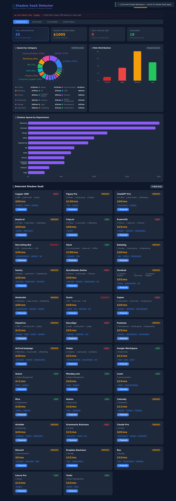
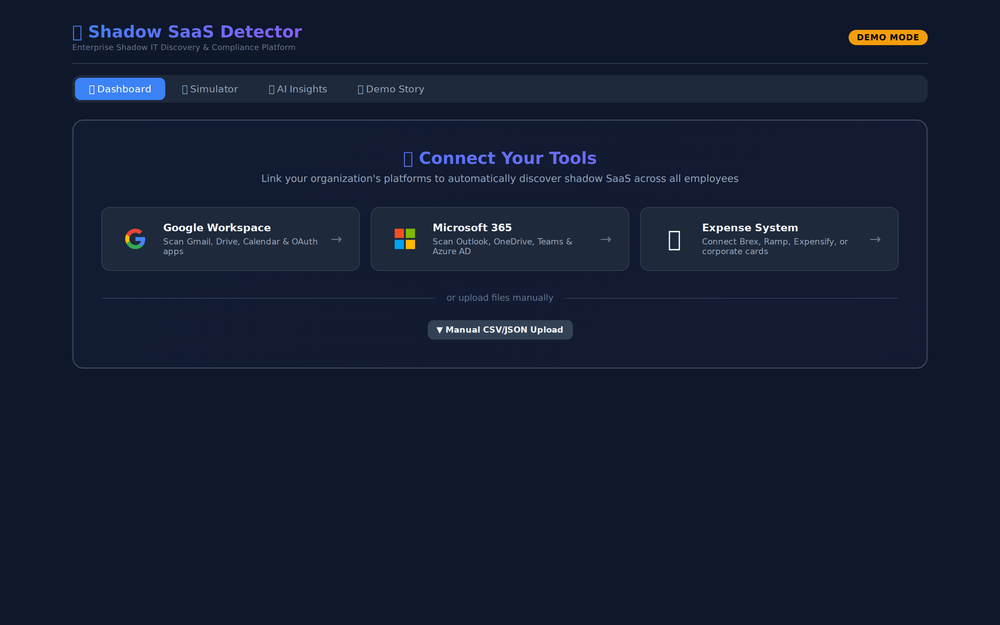
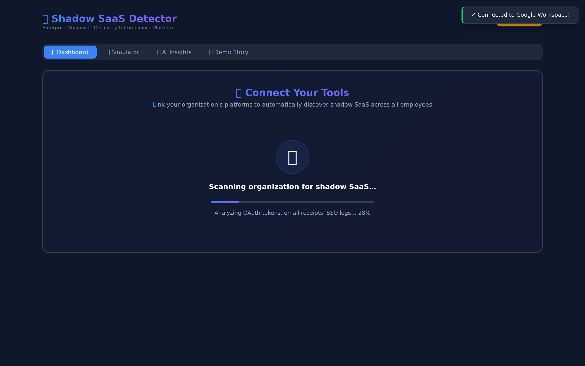
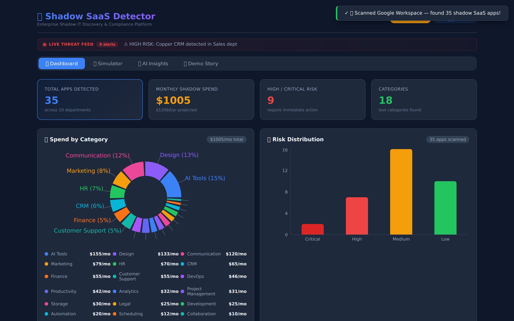
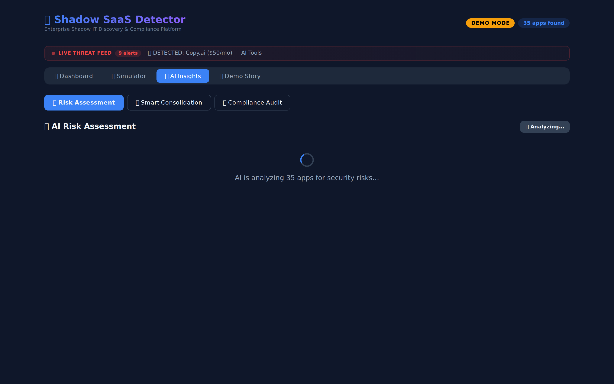
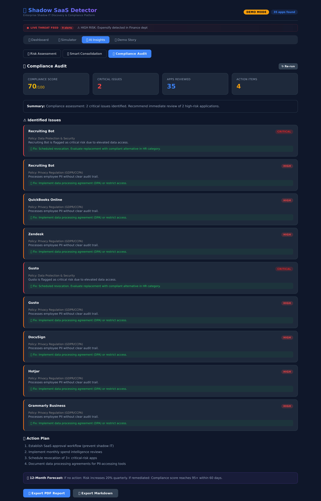
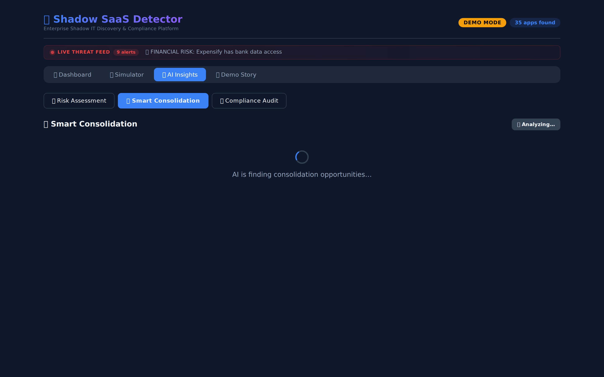
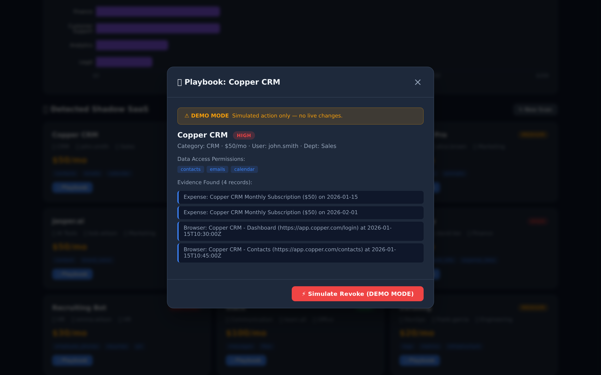
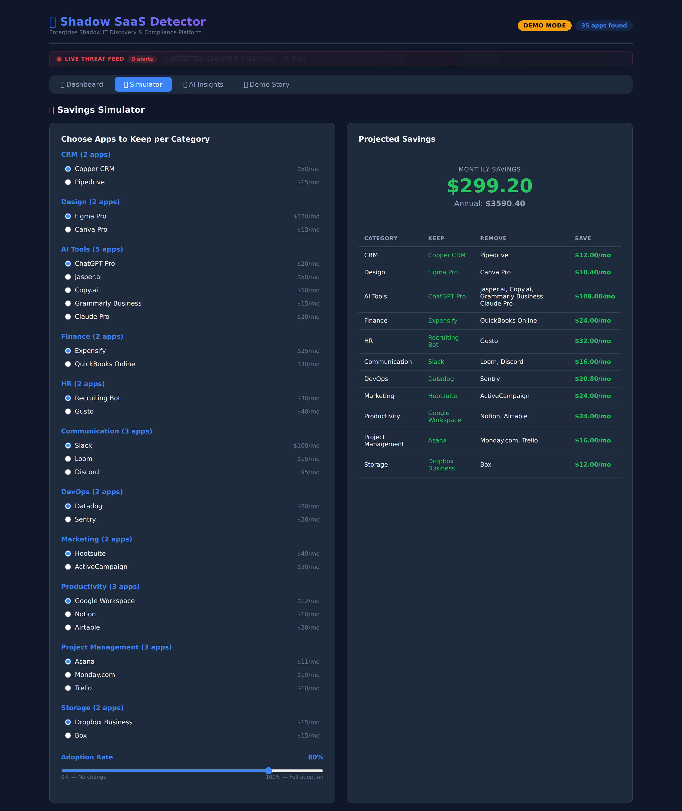

# 🔍 Shadow SaaS Detector

**Discover, assess, and eliminate unauthorized SaaS sprawl across your organization — before it becomes a security breach.**

> Companies lose **$1,000+/month** to shadow IT — unauthorized apps with access to PII, financial data, and credentials that nobody in IT knows about. Shadow SaaS Detector finds them all in seconds.



---

## The Problem

Every organization has shadow IT. Employees sign up for SaaS tools without IT approval:

- **Finance** uses 3 different expense tools — only 1 is approved
- **Marketing** has AI writing tools with access to customer data
- **Engineering** stores credentials in unauthorized password managers
- **HR** tools expose employee SSNs and phone numbers

**The result:** Wasted budget, data exposure, GDPR/CCPA violations, and zero visibility.

## The Solution

Shadow SaaS Detector connects to your organization's data sources and instantly surfaces every unauthorized tool, scores its risk, and gives you a step-by-step playbook to remediate — all powered by AI.

### One-Click Connect

No manual uploads. Connect your Google Workspace, Microsoft 365, and expense systems with a single click. The detector scans across all sources simultaneously.





### Comprehensive Detection

Cross-references expense reports, browser history, and OAuth grants against a database of **100+ known SaaS applications** across 24 categories. Detects apps that individual signals would miss.



### AI-Powered Risk Assessment

Every detected app receives a risk score based on data access permissions, compliance posture, and organizational exposure. Powered by Google Gemini with intelligent rule-based fallback.



### Compliance Audit

Automated GDPR, CCPA, SOC 2, and HIPAA compliance checking with exportable PDF and Markdown reports for auditors and legal teams.



### Smart Consolidation

AI identifies redundant tools across departments and recommends consolidation — with projected annual savings calculated automatically.



### Remediation Playbooks

Every high-risk app gets a step-by-step playbook: notify the user, migrate data, revoke access, verify removal. One-click simulated revocation with undo support.



### Cost Savings Simulator

Interactive simulator lets IT leaders model different remediation scenarios and see projected monthly/annual savings in real time.



### Live Threat Feed

Real-time ticker showing active threats as they're detected — PII exposure warnings, credential risks, unauthorized data access, and compliance violations.

---

## Key Metrics

| Metric | Value |
|--------|-------|
| SaaS apps in database | **100+** across 24 categories |
| Detection sources | Expense reports, browser history, OAuth grants |
| Risk levels scored | Critical, High, Medium, Low |
| Compliance frameworks | GDPR, CCPA, SOC 2, HIPAA |
| Export formats | PDF, Markdown |
| Unit tests | **17 passing** |
| E2E tests | Playwright automated |

---

## Tech Stack

| Layer | Technology |
|-------|-----------|
| Frontend | React 19, TypeScript 5.9, Vite 7, Recharts |
| Backend | Node.js, Express, TypeScript |
| AI Engine | Google Gemini 1.5 Flash (with rule-based fallback) |
| Testing | Vitest (unit), Playwright (e2e) |
| Deployment | Render (full-stack) |

---

## Architecture

```
┌─────────────────────────────────────────────────┐
│                   Frontend (React)               │
│  ┌──────────┐ ┌──────────┐ ┌──────────────────┐ │
│  │Dashboard │ │Simulator │ │   AI Insights    │ │
│  │ + Charts │ │          │ │Risk│Comply│Consol│ │
│  └────┬─────┘ └────┬─────┘ └────────┬─────────┘ │
│       │             │                │           │
│       └─────────────┼────────────────┘           │
│                     │ REST API                   │
├─────────────────────┼───────────────────────────-┤
│                   Backend (Express)              │
│  ┌──────────┐ ┌──────────┐ ┌──────────────────┐ │
│  │Detector  │ │Simulator │ │   AI Services    │ │
│  │ Engine   │ │ Engine   │ │Scorer│Audit│Merge│ │
│  └────┬─────┘ └──────────┘ └────────┬─────────┘ │
│       │                              │           │
│  ┌────┴─────┐                 ┌──────┴─────────┐ │
│  │SaaS DB   │                 │ Google Gemini  │ │
│  │(100 apps)│                 │ 1.5 Flash API  │ │
│  └──────────┘                 └────────────────┘ │
└──────────────────────────────────────────────────┘
```

---

## Getting Started

### Prerequisites

- Node.js 18+
- npm 9+

### Installation

```bash
# Clone the repository
git clone https://github.com/pranjal2004838/shadow-SaaS-detector.git
cd shadow-SaaS-detector

# Install all dependencies
npm install
cd frontend && npm install && cd ..
cd backend && npm install && cd ..
```

### Running Locally

```bash
# Terminal 1 — Backend (port 5000)
cd backend
npx ts-node server.ts

# Terminal 2 — Frontend (port 3000)
cd frontend
npm run dev
```

Open **http://localhost:3000** in your browser.

### Environment Variables (Optional)

Create `backend/.env.local` for AI-powered analysis:

```env
GEMINI_API_KEY=your_google_gemini_api_key
```

Without the API key, all AI features use intelligent rule-based analysis (fully functional).

### Running Tests

```bash
# Unit tests
npm test

# E2E tests
npx playwright test
```

---

## Project Structure

```
├── frontend/              # React SPA
│   └── src/
│       ├── components/    # Dashboard, Simulator, AIInsights, Charts
│       ├── services/      # API client
│       └── pages/         # Demo story
├── backend/               # Express API server
│   ├── routes/            # upload, simulate, playbook, ai
│   ├── services/          # detector, simulator, AI engines
│   └── data/              # SaaS database (100 apps)
├── test_data/             # Demo data (expenses, browser history, roster)
└── tests/                 # Unit + E2E test suites
```

---

## Demo

1. Click **"Connect Google Workspace"** on the dashboard
2. Watch the real-time scanning animation
3. Explore **35 detected shadow apps** across 17 categories
4. Click any app's **"Playbook"** button for remediation steps
5. Switch to **Simulator** to model cost savings
6. Open **AI Insights** for risk scores, compliance audit, and consolidation recommendations
7. **Export** the compliance report as PDF or Markdown

---

## License

MIT
**Estimated time to build: 64 hours (8 days)**  
**Estimated prize: $750-2,000**  

Ready? Let's build! 🚀